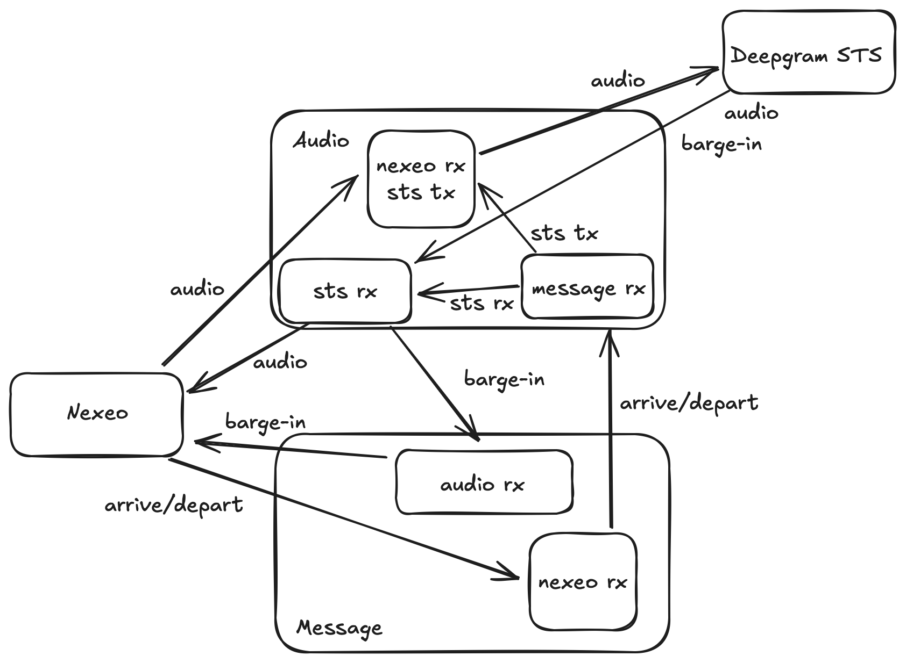
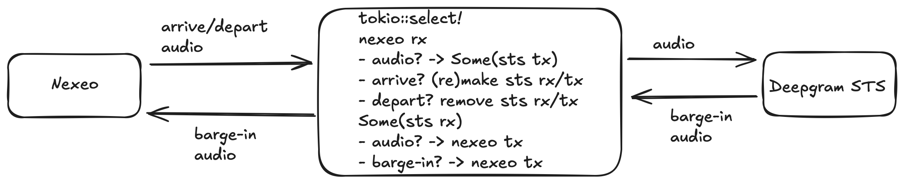

# nexeo-sts

`nexeo-sts` is a server that acts as a proxy between a Nexeo HME box and Deepgram's STS service, enabling drive-throughs with
these boxes to easily integrate with Deepgram. It also demonstrates an integration with Qu for menu retrieval and automated order taking.

## Architecture

NOTE: These diagrams are now out of date, and this section needs to be rewritten.

A diagram for the architecture of the nexeo-sts server as it is presently still needs to be made.
It would be similar as the more complex diagram below, but unfortunately would have a couple
additional pieces due to the fact that we cannot rely on echo-cancellation. The echo-cancellation
both as performed by the Nexeo/HME base station as by this server, works some ~90% of the time,
which seems good, but on the whole becomes an unacceptable user experience.

As such, the server currently relies on "ConversationText" from the "assistant" from Deepgram
to trigger on the "agent speaking" state and Nexeo "played" text message events from Nexeo
to trigger off the "agent speaking" state. Both of these events are conveyed to the
Nexeo-receiver/Deepgram-sender thread/task via channels.

|                                                                                                                                                                                                 |
| -------------------------------------------------------------------------------------------------------------------------------------------------------------------------------------------------------------------------- |
| _Caption: This shows the architecture of the nexeo-sts server, if we were able to rely on echo-cancellation. It's complexity is the consequence of Nexeo establishing separate audio/binary and message/text connections._ |

|                                                                                                                                         |
| ------------------------------------------------------------------------------------------------------------------------------------------------------------------------------ |
| _Caption: This shows how the architecture of the nexeo-sts server would be greatly simplified if Nexeo sent both binary and text messages down the same websocket connection._ |

## Deployment

This service is currently deployed at:

```
wss://nexeo.deepgram.com
```

It was deployed using the Docker Compose file in this repository, with the Docker image for the `nexeo-sts` service
being built by the Dockerfile in this repository. It also relies on the `qdrant` Docker image.

It was deployed on a beefy AWS instance where Docker was installed via the instructions here:

```
https://docs.docker.com/engine/install/ubuntu/#install-using-the-repository
```

The default user on the AWS instance (`ubuntu`) was given Docker privileges via:

```
sudo usermod -aG docker $USER
```

and then logging out and logging in. In order to access the `nexeo-sts` image, I had to log in to Docker via:

```
docker login quay.io
```

The service was exposed using `caddy` by doing the following:

1. Installing `caddy` using: https://caddyserver.com/docs/install#debian-ubuntu-raspbian
2. Editing `/etc/caddy/Caddyfile` with the following content:
```
nexeo.deepgram.com

reverse_proxy :4000
```
3. Restarting `caddy` with: `sudo systemctl restart caddy`

## Clients

The Nexeo HME box itself acts as a client, but one can also use the Python script of the standalone HTML file in the `clients` directory for easier testing.
